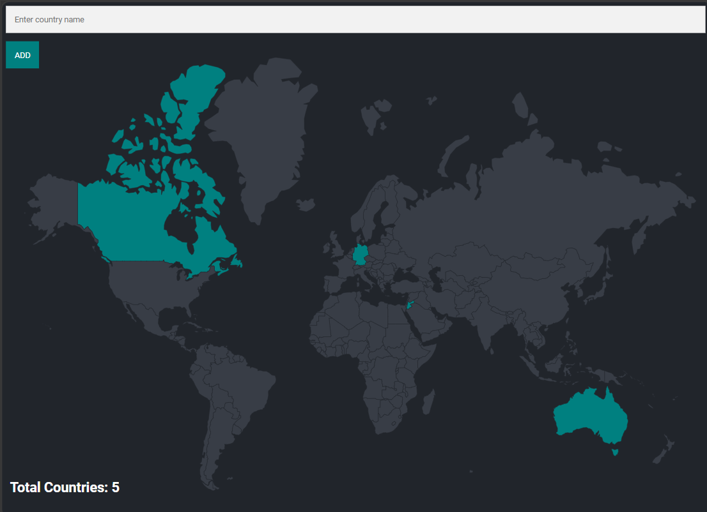

# Travel Tracker

A beginner full-stack web application that allows users to keep track of the countries they have visited. Users can add countries to their travel history, and the countries are highlighted on an interactive world map.

## Features:

* Add countries you have visited
* Interactive world map visualization
* Visited countries are highlighted automatically
* Data stored permanently using PostgreSQL
* Simple and clean user interface
* Server-side rendering with EJS

## Tech Stack:

* Frontend: EJS, HTML, CSS, JavaScript
* Backend: Node.js, Express.js
* Database: PostgreSQL

## Preview:


## 📂Project Structure:
```text
travel-tracker/
│
├── public/
│   ├── styles/
│       └── main.css
│
├── views/
│   └── index.ejs
│
├── screenshots/
│   └── screenshot.png
│
├── index.js
├── package.json
├── package-lock.json
├── queries.sql
└── README.md
```
## Installation:

1. Clone the repository

```bash
git clone https://github.com/your-username/travel-tracker.git
```
2. Navigate to the project folder

```bash
cd travel-tracker
```

3. Install dependencies

```bash
npm install
```

4. Set up PostgreSQL and create the required database.

5. Update the database connection details in the project.

6. Start the server

```bash
node index.js
```

7. Open your browser and visit

```text
http://localhost:3000
```

## Database:

The application uses PostgreSQL to store country information and the list of countries visited by the user.

## Tables:

### countries:

| Column       | Type               |
| ------------ | ------------------ |
| id           | SERIAL PRIMARY KEY |
| country_code | VARCHAR UNIQUE     |
| country_name | VARCHAR            |

### visited_countries:

| Column       | Type                                                     |
| ------------ | ---------------------------------------------------------|
| id           | SERIAL PRIMARY KEY                                       |
| country_code | VARCHAR FOREIGN KEY REFERENCES countries(country_code)   |

## What I Learned:

This project helped me practice:

* Express.js routing
* PostgreSQL database operations
* SQL queries and table relationships
* EJS templating
* Handling form submissions
* Server-side rendering with Node.js

## Future Improvements

* Support for multiple users
* User authentication
* Travel statistics dashboard
* Country search and filtering
* Travel wishlist feature

## Author

Aditi Chaudhary

This project was built as part of my journey learning full-stack web development with Node.js, Express, PostgreSQL, and EJS.
